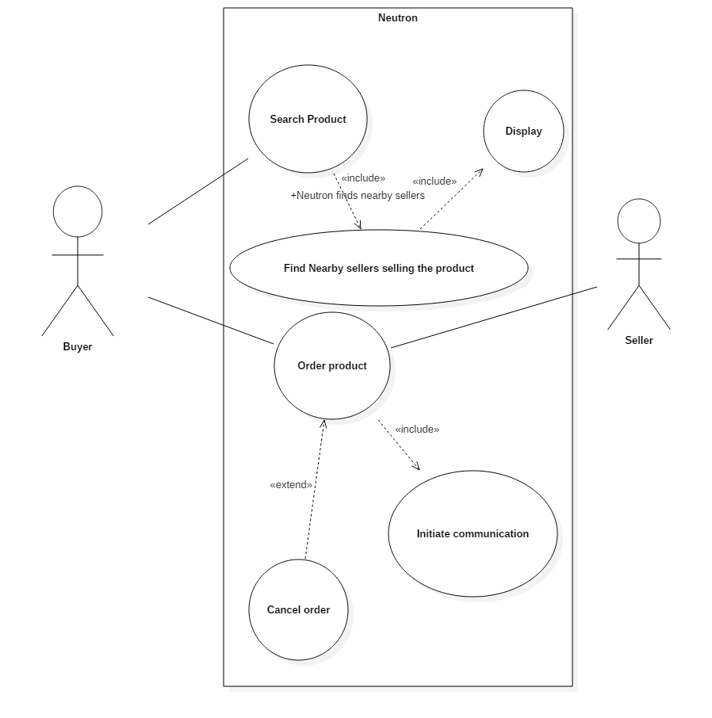
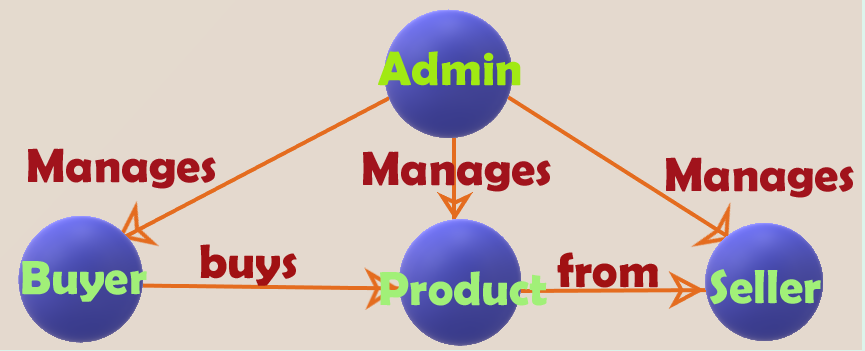
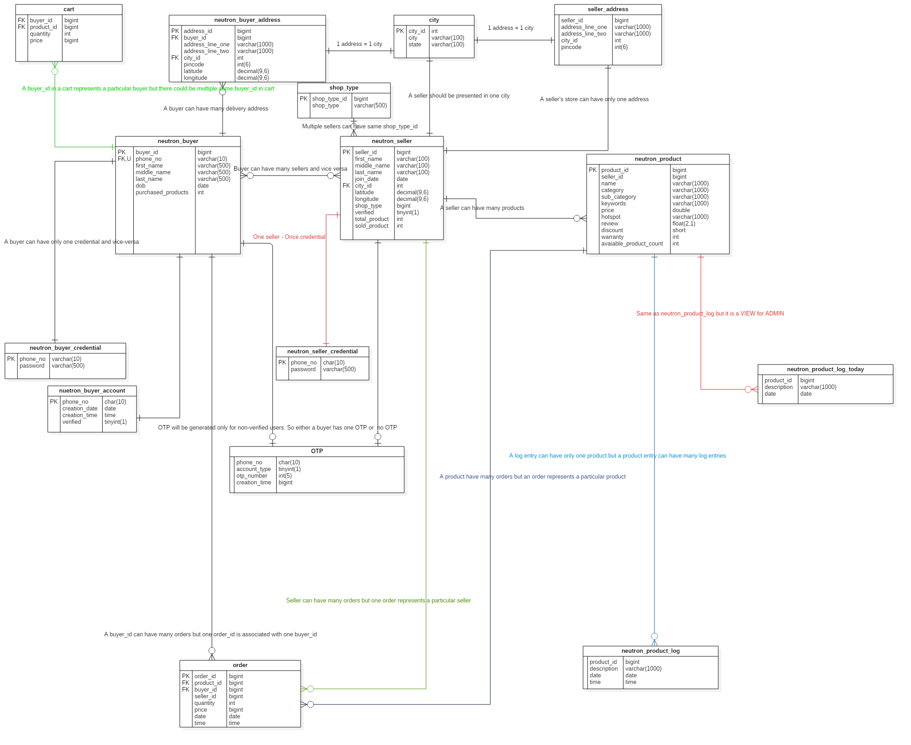

##### *The decentralized e-commerce solution (backend-restful service)*

##### Abstract:
The main aim of the project �Neutron� is to deliver the products ordered by the customers within a day to them. In a conventional e-commerce store when a customer places an order the product is taken from the warehouse of the e-commerce site and will be delivered to them; this process might take several days. But in Neutron, which is completely decentralized holds no warehouses. In Neutron there are three main components present,  

1.	Buyer.
2.	Seller.
3.	Admin. (Will discuss about this later)
4.	Product.

**BUYER:**  
The buyer is a person who buys a particular product(s).  
**SELLER:**  
The seller is a person who sells a particular product(s).  
**PRODUCT**  
An object or a thing which a buyer buys or a seller sells.  

The web service allows as many as needed number of buyers and sellers to register. The accurate geo-location like latitude, longitudes to identify a buyer�s/seller�s location will be stored in the database. If a buyer searches for the particular product the web service will start looking for the nearest possible sellers who is selling the same product and will display the result to the buyer who has queried for the product. Once the order is confirmed the product will be delivered on the same day (Since the product will be delivered by the nearby seller). A simple use case diagram explaining the working of the project is given below. Note: Use cases of the complete architecture will be given in the description.  

**Keywords:**
Shopping, E-commerce, Rest API, Python, Flask, Geo-Location, Buyers, Sellers.

**Introduction:**
This report briefly explains how a decentralized e-commerce web application is implemented using Python�s famous framework named Flask and a Relational Database Management System named MySQL. In Neutron there are four main components, 
1.	Buyer
2.	Seller
3.	Admin
4.	Product
The roles played by them is explained in the below diagram,

**1.  Buyer:**
	A buyer is a person who will purchase the products from the seller. In order to purchase products he/she must register for a neutron account. A buyer can register for a new account using his/her phone no and a password provided by him/her. Once the buyer requests for a new account, One Time Password will be sent from the web-service to make sure that the buyer actually owns the mobile no. Note: Landline cannot be used for registering a new account. 

**1.1 Buyer Details:**
The phone-no and password alone is not sufficient to create a buyer account. Buyer account will be only created when the buyer provides the following details like 
1.	First Name 
2.	Middle Name (If one is there) 
3.	Last Name 
4.	Date Of Birth 
5.	His/her address details. 
6.	The application will send the exact latitude and longitude of the buyer�s address 
7.	Total no of products purchased buy them (Initialized to 0)  
DOB of the buyer enables the buyer to buy sensitive items. If the age of the buyer is under 18 he or she will not see any sensitive items in his/her dashboard and cannot purchase those items. Once the buyer registers for a new account a unique buyer id will be generated for the buyer. All of the details will be stored in a database.  

**1.2 The sign-up process:**  
The initial stage of signup requires only the buyer�s phone number and hash of the password of the client (Here client refers to the application used by the buyer). The client will send the phone number along with the hash of the client�s password to the neutron�s server. Once the details are received by the server, the server will check both the phone number and the password hash provided by the client is benign input. If any malicious attempt is found a 400 Bad Gateway HTTP status code will be returned to the client. If the supplied parameters are found to be good then the server side scripting language will check if the account already exists or not. If the account does not exist then it will start a MySQL database transaction. The transaction consists of the following steps,  
1.	Add the phone number and the password hash to the neutron_buyer_credential table.  
2.	Initialize the account as non-verified account in neutron_buyer_account table.  
3.	Add the buyer details such as first name, middle name(which can be null), last name and the date of birth.  
4.	Add the generated OTP (this will be done in server side language) and add it to the OTP table and initialize the OTP.  
5.	COMMIT.  

If anything fails in the above transaction ABORT will be called. So, if a successful COMMIT occurs.  

*yet to be updated*  

*Database design*  

  

